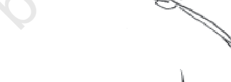
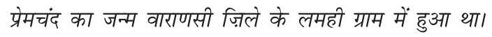
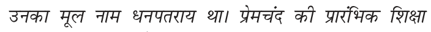
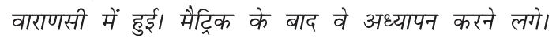
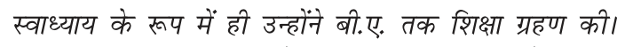
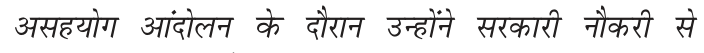
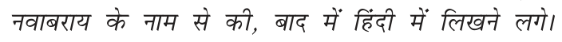
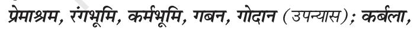
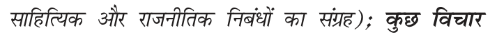

# HUMAN REVIEW QUEUE: Hindi Legacy-Font Spot-Check Verification

> **STATUS: PENDING HUMAN VERIFICATION**
> All lines below were extracted and remapped from legacy font (Walkman-Chanakya) in `eval/golden/hindi_gujarati_book/sample.pdf`.
> To establish a rigorous ground truth that does not rely on model self-evaluation, a native Hindi reader should review each line against the cropped PDF image.
> Mark **Verdict** as: `Correct` | `Wrong` (provide corrected text in Notes) | `Needs OCR` (rendering ambiguous).

---

## Verification Table (10 Sample Lines)

### Line 1 (Page 1 — Section Heading)

- **PDF Source**: Page 1 (Rect: [180, 360, 320, 410])
- **Raw Legacy Span**: `x|&[kaM`
- **Saved Remapped Text**: `गद्य-खंड`
- **Human Reader Verdict**: `[                 ]`
- **Corrected Text (if Wrong)**: `[                                         ]`
- **Notes**: 

---

### Line 2 (Page 3 — Author Heading)

- **PDF Source**: Page 3 Header (BBox: Block 2 Line 0)
- **Raw Legacy Span**: `izsepan`
- **Saved Remapped Text**: `प्रेमचंद`
- **Human Reader Verdict**: `[                 ]`
- **Corrected Text (if Wrong)**: `[                                         ]`
- **Notes**: 

---

### Line 3 (Page 3 — Sentence 1: Birthplace with Nukta)

- **PDF Source**: Page 3 Paragraph 1 (BBox: Block 2 Line 1)
- **Raw Legacy Span**: `izsepan dk tUe okjk.klh f”kys osQ yegh xzke esa gqvk FkkA`
- **Saved Remapped Text**: `प्रेमचंद का जन्म वाराणसी ज़िले के लमही ग्राम में हुआ था।`
- **Human Reader Verdict**: `[                 ]`
- **Corrected Text (if Wrong)**: `[                                         ]`
- **Notes**: 

---

### Line 4 (Page 3 — Sentence 2: Original Name & Education)

- **PDF Source**: Page 3 Paragraph 1 (BBox: Block 2 Line 2)
- **Raw Legacy Span**: `mudk ewy uke /kui=k; FkkA iszepan dh izkjafHkd f'k{kk`
- **Saved Remapped Text**: `उनका मूल नाम धनपतराय था। प्रेमचंद की प्रारंभिक शिक्षा`
- **Human Reader Verdict**: `[                 ]`
- **Corrected Text (if Wrong)**: `[                                         ]`
- **Notes**: 

---

### Line 5 (Page 3 — Sentence 3: Matriculation & Teaching)

- **PDF Source**: Page 3 Paragraph 1 (BBox: Block 2 Line 3)
- **Raw Legacy Span**: `okjk.klh esa gqbZA eSfVªd osQ ckn os vè;kiu djus yxsA`
- **Saved Remapped Text**: `वाराणसी में हुई। मैट्रिक के बाद वे अध्यापन करने लगे।`
- **Human Reader Verdict**: `[                 ]`
- **Corrected Text (if Wrong)**: `[                                         ]`
- **Notes**: 

---

### Line 6 (Page 3 — Sentence 4: Self-Study & B.A. Degree)

- **PDF Source**: Page 3 Paragraph 1 (BBox: Block 2 Line 4)
- **Raw Legacy Span**: `Lokè;k; osQ :i esa gh mUgksaus ch-,- rd f'k{kk xzg.k dhA`
- **Saved Remapped Text**: `स्वाध्याय के रूप में ही उन्होंने बी-ए- तक शिक्षा ग्रहण की।`
- **Human Reader Verdict**: `[                 ]`
- **Corrected Text (if Wrong)**: `[                                         ]`
- **Notes**: 

---

### Line 7 (Page 3 — Sentence 5: Non-Cooperation Movement)

- **PDF Source**: Page 3 Paragraph 1 (BBox: Block 2 Line 5)
- **Raw Legacy Span**: `vlg;ksx vkanksyu osQ nkSjku mUgksaus ljdkjh ukSdjh ls`
- **Saved Remapped Text**: `असहयोग आंदोलन के दौरान उन्होंने सरकारी नौकरी से`
- **Human Reader Verdict**: `[                 ]`
- **Corrected Text (if Wrong)**: `[                                         ]`
- **Notes**: 

---

### Line 8 (Page 3 — Sentence 6: Hindi Writing Transition with Bindu)

- **PDF Source**: Page 3 Paragraph 2 (BBox: Block 3 Line 1)
- **Raw Legacy Span**: `uokcjk; osQ uke ls dh] ckn esa ¯gnh esa fy[kus yxsA`
- **Saved Remapped Text**: `नवाबराय के नाम से की, बाद में हिंदी में लिखने लगे।`
- **Human Reader Verdict**: `[                 ]`
- **Corrected Text (if Wrong)**: `[                                         ]`
- **Notes**: 

---

### Line 9 (Page 3 — Major Works: Novels List with Commas)

- **PDF Source**: Page 3 Paragraph 4 (BBox: Block 4 Line 2)
- **Raw Legacy Span**: `iszekJe] jaxHkwfe] deZHkwfe] xcu] xksnku `
- **Saved Remapped Text**: `प्रेमाश्रम, रंगभूमि, कर्मभूमि, गबन, गोदान`
- **Human Reader Verdict**: `[                 ]`
- **Corrected Text (if Wrong)**: `[                                         ]`
- **Notes**: 

---

### Line 10 (Page 3 — Literary Collections: Semicolon & 'Kuchh Vichar')

- **PDF Source**: Page 3 Paragraph 4 (BBox: Block 4 Line 4)
- **Raw Legacy Span**: `lkfgfR;d vkSj jktuhfrd fucaèkksa dk laxzg); oqQN fopkj`
- **Saved Remapped Text**: `साहित्यिक और राजनीतिक निबंधों का संग्रह); कुछ विचार`
- **Human Reader Verdict**: `[                 ]`
- **Corrected Text (if Wrong)**: `[                                         ]`
- **Notes**: 

---

## Review Instructions for Human Reader

1. **Compare each cropped image visually** with the **Saved Remapped Text**.
2. Pay special attention to:
   - **Nuktas** (dot under consonants: ज़ vs ज, फ़ vs फ)
   - **Matras** (chhoti-ee `ि`, badi-ee `ी`, reph `र्`, tra `त्र`)
   - **Punctuation** (commas `,`, colons `:`, semicolons `;`, full stops `।`)
   - **Compound ligatures** (ध, द्ध, क्त, क्ष)
3. Fill in the **Verdict** (`Correct` or `Wrong`).
4. If `Wrong`, write the exact characters you see in the image into **Corrected Text**.
5. Save the file. Verified lines will then be committed to `eval/spot_checks/` as official ground truth.
